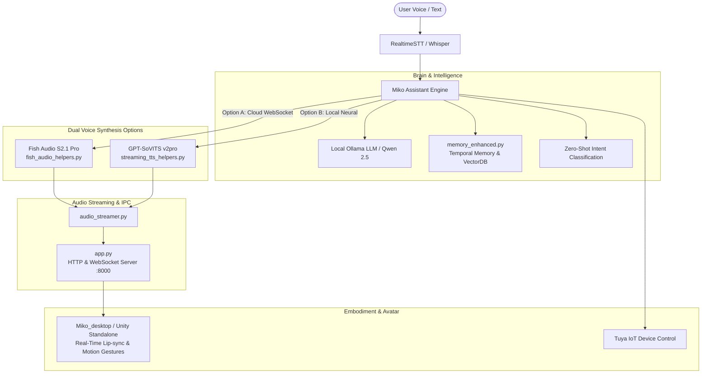

# ✨ MIKO — OneReality Desktop AI Companion ✨

<div align="center">


**An intelligent, expressive, and embodied AI desktop companion powered by Ollama, Dual Voice Synthesis (Fish Audio & GPT-SoVITS), and Unity.**

[](LICENSE)
[](https://www.python.org/)
[]()
[](https://fish.audio/)
[](https://github.com/RVC-Boss/GPT-SoVITS)

</div>

---

## 🎀 Overview

**Miko** is a real-time, interactive AI companion designed to live on your Windows desktop. She pairs local Large Language Models (via Ollama) with **two first-class voice synthesis engines**:
1. **Fish Audio S2.1 Pro**: Ultra-low-latency cloud/WebSocket streaming with expressive multilingual emotion, requiring zero local GPU VRAM for TTS.
2. **GPT-SoVITS v2pro**: 100% offline, private neural voice cloning running locally on your hardware.

Miko features an animated borderless 3D Unity desktop avatar (`Miko_desktop`), persistent human-like conversation memory, smart-home IoT control, lip-sync, and physical turntable hardware integration (**OASIS**).

---

## 🏗️ System Architecture



---

## 📂 Repository Layout

```
OneReality/
├── 🚀 Launchers & Setup
│   ├── start.bat                   # Default launcher (GPT-SoVITS local + Miko_desktop + Ollama)
│   ├── start_fishaudio.bat         # 1-Click launcher for Fish Audio S2.1 Pro Free
│   ├── start_gptsovits.bat         # Explicit launcher for local GPT-SoVITS v2pro
│   ├── setup.bat                   # Environment bootstrap & dependency installer
│   ├── OneReality.bat              # Quick launch shortcut (delegates to start.bat)
│   ├── requirements.txt            # Python dependencies
│   └── setup.py                    # Setuptools package configuration
│
├── 🧠 Core Python Application
│   ├── Miko.py                     # Main assistant engine with local GPT-SoVITS
│   ├── Miko_FishAudio.py           # Main assistant engine with Fish Audio S2.1 Pro
│   ├── app.py                      # Multi-threaded HTTP & WebSocket server for avatar IPC (:8000)
│   ├── audio_streamer.py           # Real-time chunked audio streaming client
│   ├── fish_audio_helpers.py       # Fish Audio S2.1 API client & WebSocket streaming worker
│   ├── streaming_tts_helpers.py    # GPT-SoVITS streaming inference helpers
│   ├── memory_enhanced.py          # Temporal decay, vector importance scoring & memory recall
│   ├── conversation.jsonl          # Persisted conversation memory history
│   ├── .env.example                # Example configuration template
│   └── .env                        # Local configuration (excluded from git)
│
├── 👗 3D Avatar & Unity Desktop
│   ├── Miko_desktop/               # Standalone Unity desktop avatar application
│   │   ├── Miko_desktop.exe        # Borderless transparent avatar executable
│   │   ├── Miko_desktop_Data/      # Unity player data & runtime assets
│   │   └── Assets/                 # Unity source scripts, shaders, and animations
│   └── MikoAudioReceiver.cs        # Unity C# audio stream receiver & lip-sync driver
│
├── 🎵 Reference Audio & Sound FX
│   ├── Kokomi_0.wav                # Default voice reference sample
│   ├── clap.wav                    # Motion trigger sound effect
│   ├── nodding.wav                 # Motion trigger sound effect
│   ├── shaking head.wav            # Motion trigger sound effect
│   ├── thumbs-up.wav               # Motion trigger sound effect
│   └── wave.wav                    # Motion trigger sound effect
│
├── 📦 Local Neural Models
│   └── GPT_SoVITS/                 # GPT-SoVITS runtime modules & pre-trained weights
│
├── 🤖 Hardware Integration
│   └── OASIS/                      # Physical 3D-printable motorized turntable & face tracking mount
│
└── 🧪 Testing & Verification
    ├── test_refactor_clean.py      # Core regression test suite
    ├── test_fish_audio_integration.py # Fish Audio API & streaming test suite
    └── test_gptsovits_v2pro.py     # Local GPT-SoVITS inference verification
```

---

## ⚡ Quick Start

### 1. Prerequisites
- **Operating System**: Windows 10 or Windows 11 (64-bit)
- **Python**: Python 3.10 or 3.11 with `pip`
- **Ollama**: Download and install [Ollama](https://ollama.ai/). Pull your desired model:
  ```bash
  ollama pull qwen2.5:7b
  ```
  *(Or `ollama pull llama3:latest` / `dolphin-llama3`)*
- **GPU (Optional for Fish Audio, Recommended for GPT-SoVITS)**: NVIDIA GPU with CUDA for local inference.

### 2. Installation
Run the automated setup script in PowerShell or Command Prompt:
```cmd
setup.bat
```
This script will:
1. Create a Python virtual environment in `.\venv`.
2. Upgrade `pip` and install pre-compiled PyAV wheels.
3. Install all dependencies from `requirements.txt`.
4. Copy `.env.example` to `.env` if not already present.
5. Run the test suites to verify everything is configured properly.

### 3. Configuration (`.env`)
Open `.env` in any text editor and adjust your preferences:

#### For Fish Audio:
1. Get a free API key at [https://fish.audio/app/api-keys](https://fish.audio/app/api-keys).
2. Set your key in `.env`:
   ```ini
   FISH_API_KEY=your_actual_fish_audio_api_key_here
   FISH_AUDIO_MODEL=s2.1-pro-free
   FISH_AUDIO_REFERENCE_ID=344d8217dee64170a58b6a0cf80d0e95
   FISH_AUDIO_STREAMING=true
   ```

#### For Local GPT-SoVITS:
Ensure the model paths point to your local checkpoints in `GPT_SoVITS`:
```ini
GPT_SOVITS_CONFIG_PATH=GPT_SoVITS\configs\tts_infer.yaml
GPT_SOVITS_T2S_CKPT=GPT_SoVITS\pretrained_models\s1v3.ckpt
GPT_SOVITS_VITS_PTH=GPT_SoVITS\pretrained_models\v2Pro\s2Gv2ProPlus.pth
GPT_SOVITS_REF_AUDIO=Kokomi_0.wav
GPT_SOVITS_PROMPT_LANG=en
```

---

## 🚀 Running Miko

Choose the voice engine that best fits your hardware:

### Option A: Fish Audio Mode (Fastest & Lightest)
Launch with real-time WebSocket voice streaming (requires free Fish Audio API key, no local GPU load for voice):
```cmd
start_fishaudio.bat
```
*Or directly via Python:*
```cmd
venv\Scripts\python.exe Miko_FishAudio.py
```

### Option B: Local GPT-SoVITS Mode (100% Offline)
Launch with local neural voice cloning:
```cmd
start.bat
```
*(Or `start_gptsovits.bat` / `venv\Scripts\python.exe Miko.py`)*

---

## 💃 Desktop Avatar Controls (`Miko_desktop`)

`Miko_desktop` is a borderless transparent overlay that displays Miko on your screen with real-time lip-sync, blinking, and gesture animations.

### ⚙️ Hidden Settings Menu
The settings menu in `Miko_desktop` is hidden by default to preserve a clean desktop aesthetic:
1. **Reveal the Settings Button**:
   - Hold **`Left Alt + Ctrl`** simultaneously on your keyboard.
   - While holding both keys, **hover your mouse in the top-right corner** of the application window.
   - The hidden settings gear icon will fade into view.
2. **Open the Settings Options**:
   - **Click the settings gear icon while holding `Left Alt + Ctrl`**.
   - This will reveal two setting buttons: the **IP Address Setting** icon and the **Avatar Change** icon.

### 🌐 IP Address Setting
- By default, the avatar connects to `http://localhost:8000/audio_stream` and works out of the box with `app.py`.
- If the audio does not connect, or if you are running the backend server on a different PC or across your local network:
  - Click the **IP Address icon**.
  - Enter the IPv4 address (e.g. `http://192.168.1.50:8000`) of the machine running `app.py`.

### 👗 Custom Avatar (.VRM Upload)
- Want to use your own 3D character?
  - Click the **Avatar Change icon**.
  - A Windows file browser dialog will appear.
  - Select any standard **`.vrm`** 3D model file from your computer to instantly swap Miko's avatar in real time!

### ⌨️ Additional Window Shortcuts
- **`Left Alt + Ctrl + B`**: Toggle between transparent overlay background and solid black background.
- **Normal Operation**: Click-through is automatically active during normal use so the avatar never blocks your clicks on background applications. Holding `Left Alt + Ctrl` or hovering over UI elements temporarily disables click-through so you can interact with controls.

---

## 🎮 Interaction Modes

When running Miko, you can interact through two modes:

1. **Voice Mode (Default)**:
   - **Push-to-Talk**: Press `p` to speak to Miko. The high-accuracy STT engine listens, detects speech boundaries, and responds.
   - **Continuous Listening**: Enable always-on microphone detection for hands-free conversation.
2. **Text / Typing Mode**:
   - Type your messages directly into the Kawaii CLI console for quick, silent interactions.

---

## 🧩 Subsystem Details

### 🧠 Enhanced Memory Core (`memory_enhanced.py`)
Miko features a human-like memory system that goes beyond simple context windows:
- **Temporal Decay**: Memories naturally decay in salience over time using an exponential half-life formula.
- **Importance Scoring**: Important memories (user preferences, names, facts) are scored higher and persist longer.
- **Repetition Suppression**: Prevents the assistant from looping or repeating recent statements.
- **Vector Search**: Rapid semantic recall of relevant historical context into the prompt.

### 🔊 Low-Latency Audio Streaming (`audio_streamer.py` & `app.py`)
- Real-time sentence chunking allows TTS generation and audio streaming to begin before the LLM finishes generating the entire response.
- Streams raw 32kHz/24kHz/44.1kHz PCM audio chunks over HTTP/WebSocket directly to Unity's `MikoAudioReceiver.cs` for instantaneous playback and viseme/lip-sync generation.

---

## 🧪 Testing & Verification

Run the test suites to verify system components:

```cmd
:: Test core memory, audio streamer, and IPC server
venv\Scripts\python.exe -m unittest test_refactor_clean.py

:: Test Fish Audio API client, WebSocket workers, and boundary detection
venv\Scripts\python.exe -m unittest test_fish_audio_integration.py
```

---

## 📜 License

This project is licensed under the **GNU General Public License v3.0 (GPL-3.0)** — see the [LICENSE](LICENSE) file for details.
All model weights, voices, and external assets belong to their respective creators.
