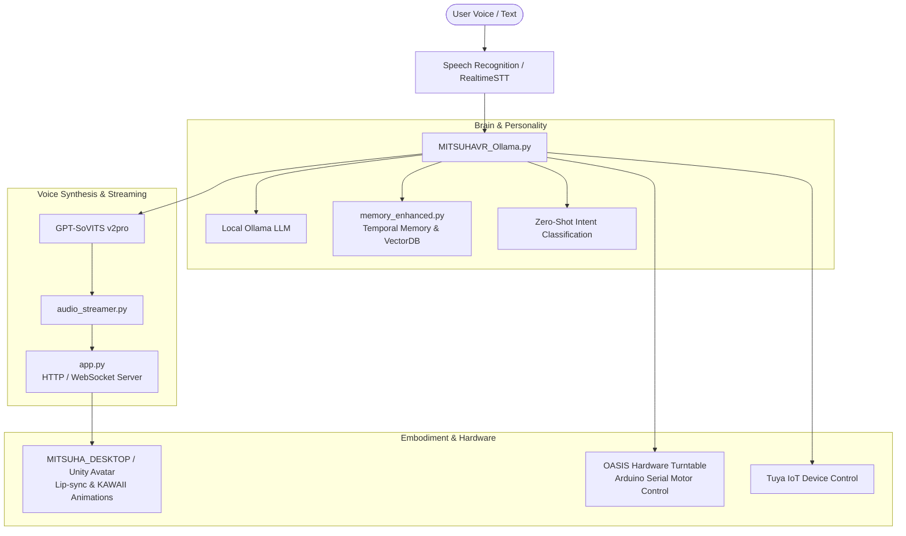

# ✨ MITSUHA — OneReality Desktop AI Companion ✨

<div align="center">


**An intelligent, expressive, and interactive AI desktop companion powered by Ollama, GPT-SoVITS, and Unity.**

[](LICENSE)
[](https://www.python.org/)
[]()
[](https://github.com/astral-sh/ruff)

</div>

---

## 🎀 Overview

**Mitsuha** is a real-time, embodied AI companion designed to live on your desktop. Combining local Large Language Models (via Ollama), cutting-edge high-fidelity voice synthesis (GPT-SoVITS v2pro), an animated 3D Unity desktop avatar, persistent temporal memory, smart-home IoT control, and physical turntable hardware (**OASIS**), Mitsuha provides an immersive personal companion experience.

---

## 🏗️ System Architecture



---

## 📂 Repository Layout

```
OneReality/
├── 🚀 Launchers & Setup
│   ├── start.bat                   # 1-Click launcher (Ollama + Unity Avatar + Python Assistant)
│   ├── setup.bat                   # Environment bootstrap & dependency installer
│   ├── OneReality.bat              # Quick launch shortcut (delegates to start.bat)
│   ├── requirements.txt            # Python dependencies
│   └── setup.py                    # Setuptools package configuration
│
├── 🧠 Core Python Application
│   ├── MITSUHAVR_Ollama.py         # Main assistant engine (kawaii CLI, heart loop, STT, intent handling)
│   ├── app.py                      # Multi-threaded HTTP & WebSocket server for avatar IPC
│   ├── audio_streamer.py           # Real-time chunked audio streaming client to Unity avatar
│   ├── memory_enhanced.py          # Temporal decay, vector importance scoring & conversation memory
│   ├── conversation.jsonl          # Persisted conversation memory history
│   └── .env                        # Local configuration & environment variables
│
├── 🎵 Audio & Voice Synthesis
│   ├── GPT-SoVITS-v2pro-20250604/  # GPT-SoVITS v2pro neural voice model weights & configs
│   ├── GPT_SoVITS/                 # GPT-SoVITS core runtime modules
│   ├── Kokomi_0.wav                # Default reference voice sample
│   ├── out.wav                     # Last synthesized response audio
│   └── [emotion].wav               # Emotion audio triggers (wave, nodding, clap, shaking head, thumbs-up)
│
├── 👗 3D Avatar & Unity Desktop
│   ├── MITSUHA_DESKTOP/            # Standalone Unity desktop avatar application
│   ├── MITSUHA_DESKTOP_OASIS/      # Unity desktop companion build with OASIS tracking
│   ├── MitsuhaAudioReceiver.cs     # C# Unity component for receiving audio stream & driving lip-sync
│   └── KAWAII ANIMATIONS 100 v1.9.0/ # Asset pack containing expressive avatar animations
│
├── 🤖 Hardware & Physical Companion
│   └── OASIS/                      # Physical 3D-printable motorized turntable & face-tracking mount
│       ├── OASIS.ino               # Arduino firmware for motor control & face tracking
│       ├── OASIS Base (Motor).step # CAD model: Motor housing
│       ├── OASIS Base (Bearing).step # CAD model: Bearing base
│       ├── OASIS Gears.step        # CAD model: Drive gears
│       └── OASIS Turntable.step    # CAD model: Revolving platform
│
├── 👁️ Vision & Machine Learning Tasks
│   ├── gesture_recognizer.task     # MediaPipe hand gesture recognition model
│   └── pose_landmarker_lite.task   # MediaPipe face & body pose landmarker model
│
├── 🧪 Testing & Verification
│   ├── test_refactor_clean.py      # Regression test suite for memory, audio, server, and core
│   └── test_gptsovits_v2pro.py     # GPT-SoVITS v2pro inference verification
│
└── 📄 Documentation & Assets
    ├── README.md                   # This comprehensive repository guide
    ├── AGENTS.md                   # GitNexus code intelligence instructions
    ├── CLAUDE.md                   # Assistant development instructions
    ├── STREAMING_INTEGRATION_GUIDE.md # Audio streaming architecture documentation
    ├── Branding ideas/             # Design assets, color schemes, and icon concepts
    └── OneReality Logo Transparent.png # Project brand logo
```

---

## ⚡ Quick Start

### 1. Prerequisites
- **Operating System**: Windows 10 or 11 (64-bit)
- **Python**: Python 3.10 or 3.11 with `pip`
- **GPU**: NVIDIA GPU with CUDA support (recommended for low-latency TTS & STT)
- **Ollama**: Download and install [Ollama](https://ollama.ai/). Pull your desired model:
  ```bash
  ollama pull llama3:latest
  ```

### 2. Installation
Run the automated bootstrap script:
```cmd
setup.bat
```
This script will:
1. Create a clean virtual environment in `.\venv`.
2. Upgrade `pip` and install pre-built `av` wheels.
3. Install all dependencies from `requirements.txt`.
4. Run the regression test suite (`test_refactor_clean.py`) to verify health.

### 3. Environment Configuration
Copy `.env.example` (or edit `.env`) to set your local preferences:
```ini
# User Profile
YOUR_NAME=Danu

# Network & Server
IP_ADDRESS=localhost
PORT=8000

# Voice Reference
GPT_SOVITS_REF_AUDIO=Kokomi_0.wav
LANGUAGE=en

# Smart Home (Optional)
TUYA_ACCESS_ID=your_id_here
TUYA_ACCESS_KEY=your_key_here
```

### 4. Launch Mitsuha
To launch the full stack (Ollama service + Unity Avatar + Python Companion):
```cmd
start.bat
```
Alternatively, launch just the Python assistant in interactive mode:
```cmd
venv\Scripts\python.exe MITSUHAVR_Ollama.py
```

---

## 🎮 Interaction Modes

When running `MITSUHAVR_Ollama.py`, you can choose between two interaction styles:

1. **Voice Mode (Default)**:
   - **Push-to-Talk**: Press `p` to speak to Mitsuha. The high-accuracy STT engine listens, detects speech boundaries, and responds.
   - **Continuous Listening**: Enable always-on microphone detection for hands-free conversation.
2. **Text / Typing Mode**:
   - Type your messages directly into the Kawaii CLI console for quick, silent interactions.

---

## 🧩 Subsystem Details

### 🧠 Enhanced Memory Core (`memory_enhanced.py`)
Mitsuha features a human-like memory system that goes beyond simple context windows:
- **Temporal Decay**: Memories naturally decay in salience over time using an exponential half-life formula.
- **Importance Scoring**: Important memories (declarations of love, user preferences, names, facts) are scored higher and persist longer.
- **Repetition Suppression**: Prevents the assistant from looping or repeating recent statements.
- **Vector Search**: Rapid semantic recall of relevant historical context into the prompt.

### 🔊 Low-Latency Audio Streaming (`audio_streamer.py` & `app.py`)
- Real-time sentence chunking allows TTS generation and audio streaming to begin before the LLM finishes generating the full response.
- Streams raw 32kHz/24kHz PCM audio chunks over HTTP/WebSocket directly to Unity's `MitsuhaAudioReceiver.cs` for instantaneous playback and viseme/lip-sync generation.

### 💃 Unity Desktop Avatar (`MITSUHA_DESKTOP/`)
- Borderless transparent desktop overlay window featuring an anime avatar.
- Dynamic emotion-driven animations: triggers gestures like `(wave)`, `(nodding)`, `(shaking head)`, `(clap)`, and `(thumbs-up)` synchronized with voice.

### 🎛️ OASIS Physical Turntable (`OASIS/`)
- Custom 3D-printable physical hardware base with motor driver and bearing mount.
- Driven via Arduino (`OASIS.ino`), allowing the physical avatar mount or camera to track the user dynamically around the room.

---

## 🧪 Development & Testing

### Running Unit Tests
```cmd
venv\Scripts\python.exe -m unittest test_refactor_clean.py
```
This tests:
- Memory scoring, temporal decay, and retrieval logic.
- Audio streamer configuration and chunking.
- Avatar IPC server initialization.
- Console ANSI gradient formatting.

### Code Quality & Formatting
We use [Ruff](https://github.com/astral-sh/ruff) for rapid, standardized linting:
```cmd
venv\Scripts\ruff.exe check .
```

### Code Intelligence (GitNexus)
This repository is indexed with GitNexus for call-graph intelligence and blast-radius analysis:
```cmd
node .gitnexus/run.cjs detect-changes --scope all --repo .
```

---

## 📜 License

This project is licensed under the **GNU General Public License v3.0 (GPL-3.0)** — see the [LICENSE](LICENSE) file for details.
All model weights and external assets belong to their respective creators.
